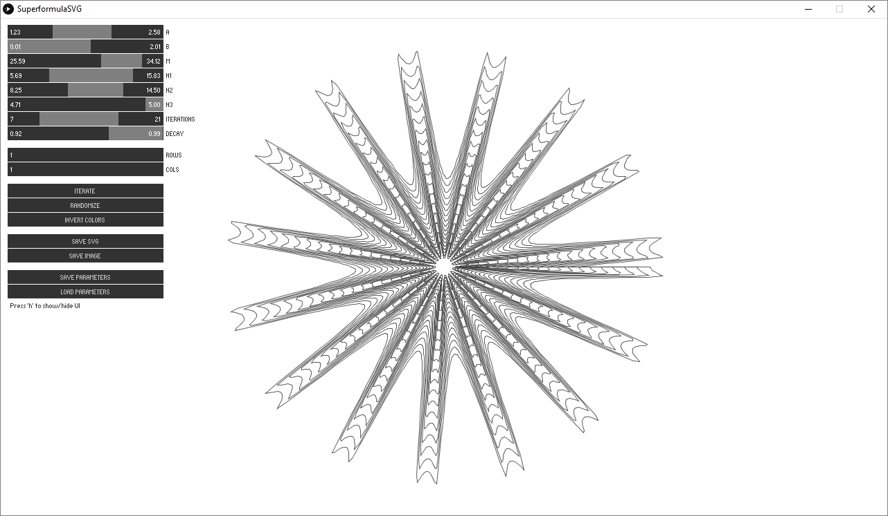
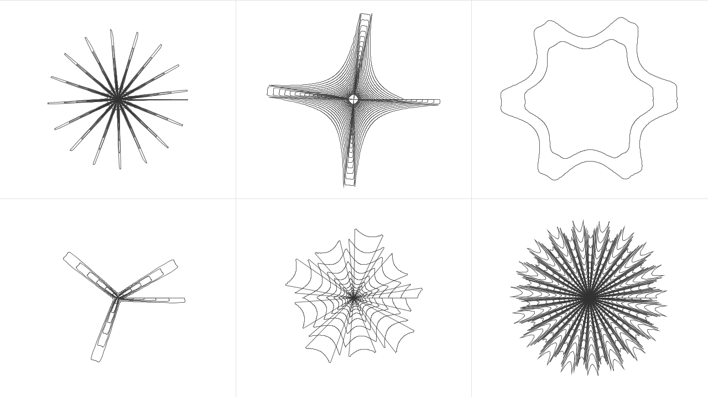
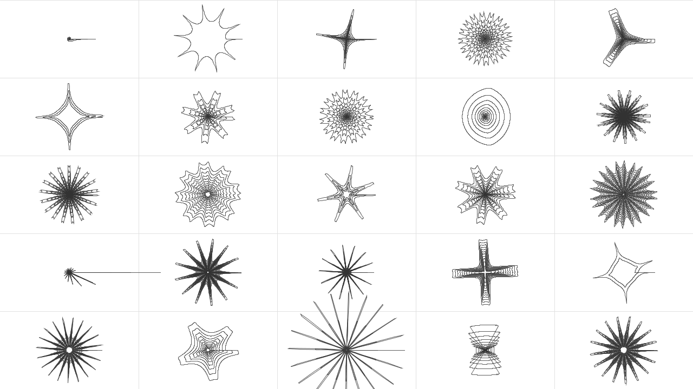

# SuperformulaSVG

Generative superformula line-art generator built in Processing, supporting vector output using Geomerative.

Based on code provided by Form+Code: http://formandcode.com/code-examples/visualize-superformula

---

### About the superformula

The superformula is a mathematical method for generating radial geometry with diverse, often organic-looking features. It is described by the following formula:

Where __&phi;__ (phi) is an angle (between 0-359) and the resulting value __r__ being the radius of the geometry at that angle.

I personally like to think of the various parameters as:
* __a__ and __b__ do _something_, but not sure yet
* __m__ is the number of peaks per revolution
* __n1__ inversely correlates to the convexity of curvature between peak (smaller numbers make deeper valleys)
* __n2__ relates to the presence and size of larger, smoother mounds between the peaks created by __m__ that are inversely proportional in size to the size of those peaks. Larger mounds results in smaller peaks and vice versa.
* __n3__ relates to overall degree of "extremeness" between peaks and valleys.

Following the example set by the original Form+Code example I also include the ability to run multiple iterations of the superformula with slightly changing (decaying) parameter values. You can control these parameters using the __iterations__ and __decay__ sliders.

Learn more about the superformula through:
* Daniel Shiffman's [Coding Challenge #23: 2D Supershapes](https://www.youtube.com/watch?v=ksRoh-10lak).
* [Wikipedia entry on supershapes](https://en.wikipedia.org/wiki/Superformula) (also relevant is the [superellipse](https://en.wikipedia.org/wiki/Superellipse) page).
* Paul Bourke's article ["Supershapes (Superformula)"](http://paulbourke.net/geometry/supershape/)

---

### Keyboard commands:
* __Space__ = trigger a new iteration
* __s__ = save an SVG containing all geometry on screen
* __i__ = save an image (PNG) of the current screen
* __r__ = randomize parameters
* __n__ = invert colors
* __h__ = hide/show UI
* __p__ = save parameters to JSON file
* __l__ = load parameters from JSON file

---

### Screenshots

